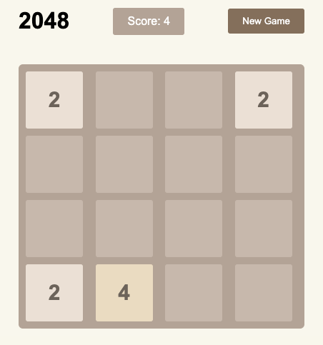
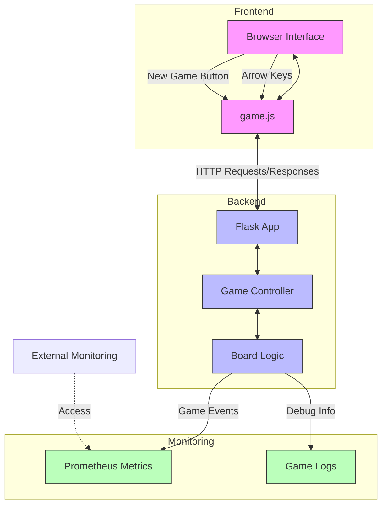

# 2048
A web-based implementation of the popular 2048 game built with Flask for the backend and JavaScript for the frontend. Includes Prometheus monitoring for tracking game metrics.



# Getting Started
## Clone the Repository
```
git clone https://github.com/yourusername/2048-webapp.git
cd 2048-webapp
```
## Install Dependencies
```
pip install -r requirements.txt
```

## Run the game
```
python -m app
```
## Access the game
```
http://127.0.0.1:5000
```
## How to Restart a New Game
Click the "New Game" button in the UI or send a POST request:
```
curl -X POST http://127.0.0.1:5000/new_game
```

# Monitoring with Prometheus
This project includes Prometheus metrics to track game moves, scores, and session durations.
## Access Metrics
You can access Prometheus metrics at:

- Standalone Prometheus Server:
```
http://localhost:8000/metrics
```
or 

- Flask Metrics Route:
```
http://127.0.0.1:5000/metrics
```

# Running Tests
```
pytest tests/
```

# Architecture
The overview of the architecture is as follows:


# License

This project is open-source and licensed under the MIT License.

